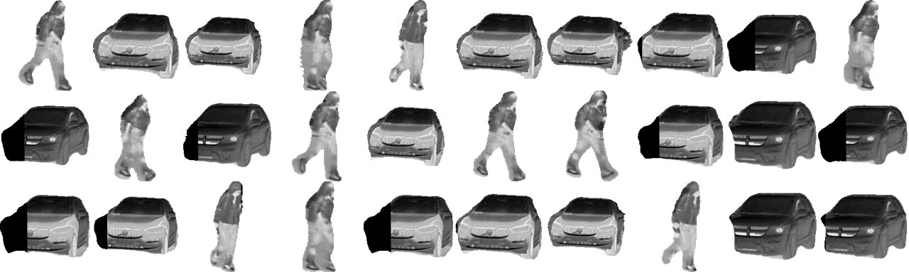
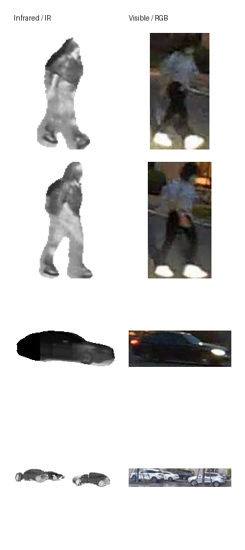

# Infrared Elements Dataset

Infrared Elements Dataset is a collection of cropped infrared target elements and paired visible/RGB references for research, teaching, and non-commercial experimentation in infrared simulation, target composition, detection, and data analysis workflows.

The repository contains documentation, metadata, checksums, preview samples, and utility scripts. The complete dataset archive is distributed through GitHub Releases instead of being stored in Git history.

## Download

Download the full dataset from the project Releases page:

<https://github.com/Aubrey-Alex/infrared-elements-dataset/releases>

Expected release asset:

| File | Size | SHA256 |
| --- | ---: | --- |
| `infrared-elements-v1.0.0.zip` | 663.33 MiB compressed / 730.90 MiB uncompressed | See [metadata/checksums.sha256](metadata/checksums.sha256) |

After downloading, verify the archive:

```bash
python scripts/verify_checksum.py infrared-elements-v1.0.0.zip
```

Or download and verify with:

```bash
python scripts/download_dataset.py --output data/infrared-elements-v1.0.0.zip
python scripts/verify_checksum.py data/infrared-elements-v1.0.0.zip
```

## Dataset Contents

- 30,552 PNG images
- 10 source subsets
- infrared/visible target crops from video-like filtered sequences
- infrared/RGB person and vehicle element crops
- total uncompressed file size: 730.90 MiB

See [metadata/statistics.json](metadata/statistics.json) for detailed counts, [metadata/manifest.csv](metadata/manifest.csv) for per-file metadata, and [metadata/file_checksums.sha256](metadata/file_checksums.sha256) for per-image checksums.

## Data Preview

Infrared cutout primitives:



Paired infrared and visible/RGB cutouts:



## Repository Layout

```text
README.md
DATASET_CARD.md
CITATION.cff
CHANGELOG.md
LICENSE
docs/
  structure.md
  license-and-usage.md
metadata/
  manifest.csv
  checksums.sha256
  file_checksums.sha256
  statistics.json
samples/
  preview/
    ir_cutout_grid.png
    object_grid.png
    paired_examples.png
    preview_grid.png
scripts/
  build_metadata.py
  download_dataset.py
  preview_pairs.py
  verify_checksum.py
  preview_grid.py
```

The data generation program is not included in this repository. This repository publishes the dataset assets, descriptive metadata, verification files, preview samples, and data access utilities only.

## Quick Start

```python
from pathlib import Path
from PIL import Image

root = Path("data/infrared-elements")
image_path = next(root.rglob("*.png"))

with Image.open(image_path) as image:
    print(image_path, image.size, image.mode)
```

## Citation

If this dataset is useful in your work, cite it using [CITATION.cff](CITATION.cff).

## License

See [LICENSE](LICENSE) and [docs/license-and-usage.md](docs/license-and-usage.md). The dataset is intended for research, teaching, and non-commercial use unless separate written permission is granted.
